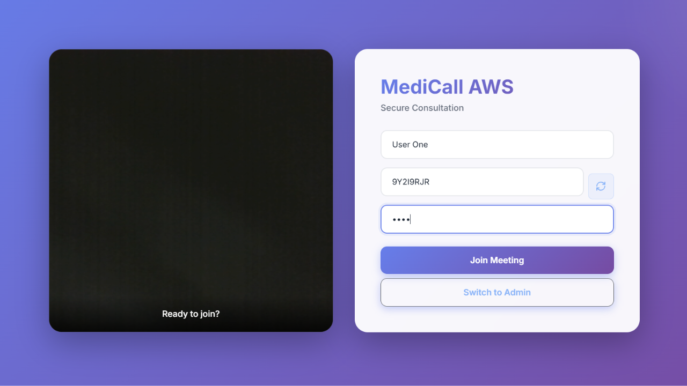
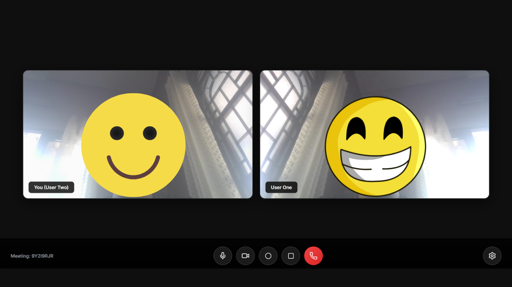

# MediCall AWS (Chime SDK Implementation)

This project is a React + Express implementation of a video consultation app using the **Amazon Chime SDK**.

## Prerequisites

1. **AWS Account**: You need an AWS account.
2. **IAM User**: Create an IAM user with `AmazonChimeFullAccess` permissions.
3. **AWS Credentials**: Obtain an Access Key ID and Secret Access Key.

## Project Structure

- `backend/`: Node.js Express server to manage meeting sessions.
- `frontend/`: React application using `amazon-chime-sdk-js`.

## Setup Instructions

### 1. Backend Setup
1. Navigate to the `backend` folder.
2. Create a `.env` file based on `.env.example`:
   ```env
   AWS_ACCESS_KEY_ID=your_access_key
   AWS_SECRET_ACCESS_KEY=your_secret_key
   AWS_REGION=us-east-1
   PORT=4000
   ```
3. Run `npm install`.
4. Run `node server.js`.

### 2. Frontend Setup
1. Navigate to the `frontend` folder.
2. Run `npm install`.
3. Run `npm run dev`.
4. Open your browser at `http://localhost:3001`.

## Screenshots

### Join Interface
Enter your name and room ID to join or create a meeting:



### Active Video Call
Two-person video consultation in progress:



## How it Works

1. **Signaling**: When you enter a Room ID and click Join, the frontend calls the `/join` endpoint.
2. **Meeting Creation**: The backend uses the AWS Chime SDK to create a "Meeting" (if it doesn't exist) and an "Attendee".
3. **Session Information**: The backend returns the `JoinInfo` (Meeting and Attendee data).
4. **Media Session**: The frontend uses `amazon-chime-sdk-js` to initialize a `DefaultMeetingSession` and bind audio/video elements to the browser.
5. **Direct Media**: Media flows through AWS Chime's media services (which includes built-in TURN relay), ensuring 100% connectivity even through firewalls.

## 🔔 Real-Time Presence Detection

### How Your Browser Knows When Someone Joins/Leaves

The application uses **AWS Chime SDK's real-time signaling** to instantly notify all participants when someone joins or leaves a meeting.

#### Architecture Overview

```
┌─────────────────────────────────────────────────────────────┐
│                    AWS Chime SDK                            │
│              (Real-time Signaling Server)                   │
└─────────────────────────────────────────────────────────────┘
                    ↑                    ↑
                    │                    │
        Real-time   │                    │   Real-time
        WebSocket   │                    │   WebSocket
        Connection  │                    │   Connection
                    │                    │
            ┌───────┴────────┐   ┌───────┴────────┐
            │   Browser 1    │   │   Browser 2    │
            │   (You)        │   │   (Other User) │
            └────────────────┘   └────────────────┘
```

#### The Process

**1. Subscription to Presence Events**
```javascript
// When you join, your browser subscribes to presence updates
audioVideo.realtimeSubscribeToAttendeeIdPresence(
    attendeePresenceObserver.attendeeIdPresenceHandler
);
```

**2. When Someone Joins:**
- User joins the meeting
- AWS Chime SDK detects the new connection
- Chime sends a **real-time WebSocket signal** to ALL connected browsers
- Your browser receives: `{ attendeeId, present: true }`
- Your app fetches the roster to get their name
- Shows notification: "Bob joined"
- Updates the participant list

**3. When Someone Leaves:**
- User leaves (closes browser, clicks "End Call", or loses connection)
- AWS Chime SDK detects the disconnection
- Chime sends a **real-time WebSocket signal** to ALL remaining browsers
- Your browser receives: `{ attendeeId, present: false }`
- Shows notification: "Bob left"
- Removes them from the participant list

#### Key Technologies

1. **WebSocket Connection** 🔌
   - Persistent, bidirectional connection between browser and AWS Chime
   - Allows instant, real-time updates (no polling needed!)
   - Stays open for the entire meeting duration

2. **Observer Pattern** 👀
   - Your browser "observes" the meeting
   - AWS Chime "notifies" all observers when something changes
   - Like subscribing to notifications

3. **Event-Driven Architecture** ⚡
   - No constant checking "did someone join? did someone leave?"
   - AWS Chime **pushes** updates to you when events happen
   - Very efficient and instant (milliseconds delay)

#### Why This is Better Than Polling

❌ **Old way (Polling):**
```javascript
// Check every 2 seconds if roster changed
setInterval(() => {
    fetch('/api/roster').then(...)  // Wasteful!
}, 2000);
```
- Wastes bandwidth
- Delayed updates (up to 2 seconds)
- Unnecessary server load

✅ **Current way (WebSocket + Observer):**
```javascript
// Subscribe once, get instant updates
audioVideo.realtimeSubscribeToAttendeeIdPresence(handler);
```
- Instant updates (milliseconds)
- No wasted requests
- Efficient and scalable

#### Code Implementation

The presence handler in `App.jsx`:

```javascript
const attendeePresenceObserver = {
    attendeeIdPresenceHandler: async (attendeeId, present, externalUserId, dropped) => {
        if (present) {
            // Someone joined - fetch updated roster
            const response = await fetch(`${API_URL}/api/roster/${roomId}`);
            const data = await response.json();
            const attendeeName = data.roster[attendeeId] || 'Someone';
            
            showNotification(`${attendeeName} joined`, 'join');
            setAttendeeRoster(data.roster);
        } else {
            // Someone left
            const leavingName = attendeeRoster[attendeeId] || 'Someone';
            showNotification(`${leavingName} left`, 'leave');
            
            // Remove from roster
            setAttendeeRoster(prev => {
                const updated = { ...prev };
                delete updated[attendeeId];
                return updated;
            });
        }
    }
};
```

#### Backend Roster Management

The backend maintains a roster mapping `attendeeId → name`:
```javascript
{
  "abc-123-def": "Alice",
  "xyz-789-ghi": "Bob"
}
```

When a join/leave event occurs, the frontend fetches this roster to display human-readable names.

### Summary

**Real-time presence detection flow:**
1. ✅ **WebSocket connection** to AWS Chime SDK (always open)
2. ✅ **Observer subscription** to presence events
3. ✅ **Real-time push notifications** from Chime when anyone joins/leaves
4. ✅ **Event handler** processes these events
5. ✅ **UI updates** automatically (React state changes)

**Result:** Instant, efficient, and automatic presence notifications with no polling! 🚀

